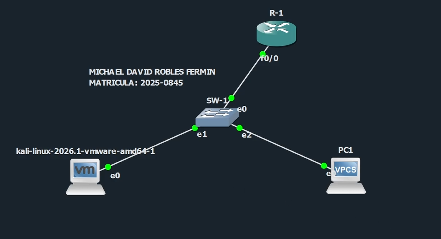
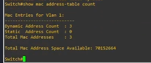
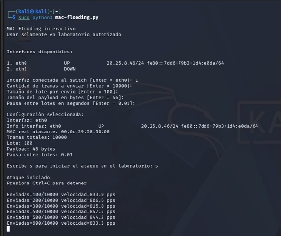
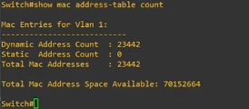
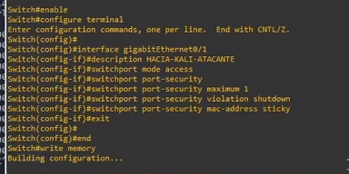
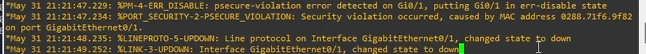

# MAC Flooding Attack Lab


## Información del proyecto

- **Autor:** Michael David Robles Fermín
- **Matrícula:** 2025-0845
- **Asignatura:** Seguridad de Redes
- **Repositorio:** https://github.com/iClexi/MAC-Flooding-Attack
- **Video:** https://www.youtube.com/watch?v=hgLU0CCh8_k
- **Documentación técnica profesional:** [docs/documentacion-tecnica-profesional.pdf](docs/documentacion-tecnica-profesional.pdf)

## Aviso de uso responsable

Este proyecto fue desarrollado únicamente con fines educativos, académicos y de laboratorio controlado. Las pruebas deben ejecutarse solamente en entornos propios o autorizados como GNS3, EVE-NG, PNETLab o laboratorios internos. No debe utilizarse en redes públicas, empresariales o de terceros sin autorización explícita.

## Objetivo del laboratorio

Demostrar el funcionamiento de un ataque **MAC Flooding**, donde el atacante envía una gran cantidad de tramas Ethernet con direcciones MAC falsas para intentar saturar la tabla CAM/MAC del switch. Posteriormente, se valida una contramedida basada en **Port Security**, limitando a una sola dirección MAC en el puerto del atacante y configurando la acción de violación en modo **shutdown**.

## Topología de laboratorio



## Flujo del laboratorio

### 1. Estado inicial del switch

Antes de iniciar el ataque, se verifica el conteo de entradas MAC en el switch:

```cisco
show mac address-table count
```



### 2. Ejecución del script de ataque

El ataque se ejecuta desde Kali Linux con el script interactivo:

```bash
sudo python3 mac-flooding.py
```



### 3. Verificación del incremento de direcciones MAC

Luego de iniciar el ataque, el switch muestra un aumento significativo en el conteo de direcciones MAC dinámicas aprendidas:

```cisco
show mac address-table count
```



### 4. Aplicación de la contramedida

En el puerto conectado a Kali se configura **Port Security** con un máximo de una dirección MAC, aprendizaje sticky y acción de violación en modo shutdown:

```cisco
enable
configure terminal
interface gigabitEthernet0/1
description MACIA-KALI-ATACANTE
switchport mode access
switchport port-security
switchport port-security maximum 1
switchport port-security violation shutdown
switchport port-security mac-address sticky
exit
end
write memory
```



### 5. Evidencia de la violación de seguridad

Cuando el ataque vuelve a intentar usar múltiples direcciones MAC desde el mismo puerto, el switch detecta la violación y coloca la interfaz en estado **err-disabled**:

```cisco
show logging
```



## Contramedida aplicada

La mitigación utilizada en este laboratorio fue **Port Security** sobre el puerto del atacante. Los elementos clave fueron:

- `switchport port-security`: habilita Port Security.
- `switchport port-security maximum 1`: permite solo una MAC en el puerto.
- `switchport port-security mac-address sticky`: aprende y fija la MAC legítima.
- `switchport port-security violation shutdown`: apaga el puerto si detecta múltiples MAC.

## Enlaces directos

- **Repositorio:** https://github.com/iClexi/MAC-Flooding-Attack
- **Video:** https://www.youtube.com/watch?v=hgLU0CCh8_k
- **Documentación técnica profesional:** [docs/documentacion-tecnica-profesional.pdf](docs/documentacion-tecnica-profesional.pdf)

## Conclusión

El ataque MAC Flooding evidenció que un switch puede aprender miles de direcciones MAC falsas en un corto período de tiempo, alterando su comportamiento normal de conmutación y afectando la estabilidad de la red. La evidencia del laboratorio mostró un incremento abrupto de entradas dinámicas en la tabla MAC del switch después de ejecutar el script desde Kali Linux.

La contramedida implementada mediante Port Security resultó efectiva, ya que el switch detectó la presencia de múltiples direcciones MAC en el puerto del atacante y activó una violación de seguridad, colocando la interfaz en estado err-disabled. Esto demostró que una configuración adecuada de seguridad en puertos de acceso reduce significativamente el riesgo asociado a este tipo de ataque.
